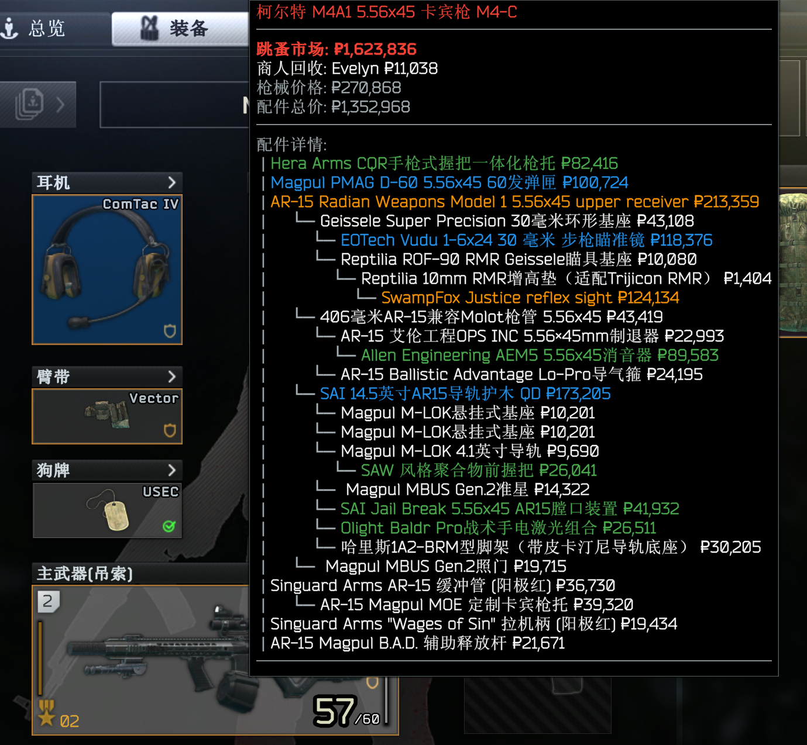
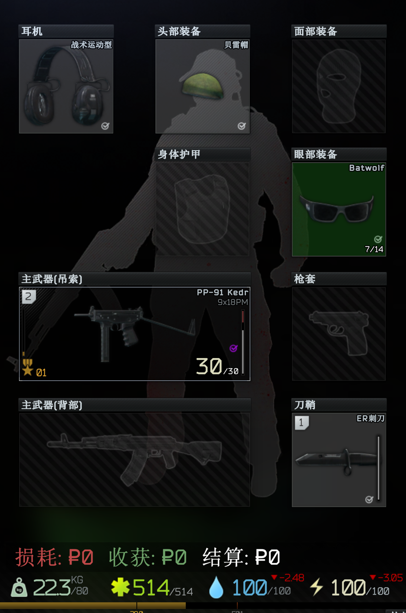
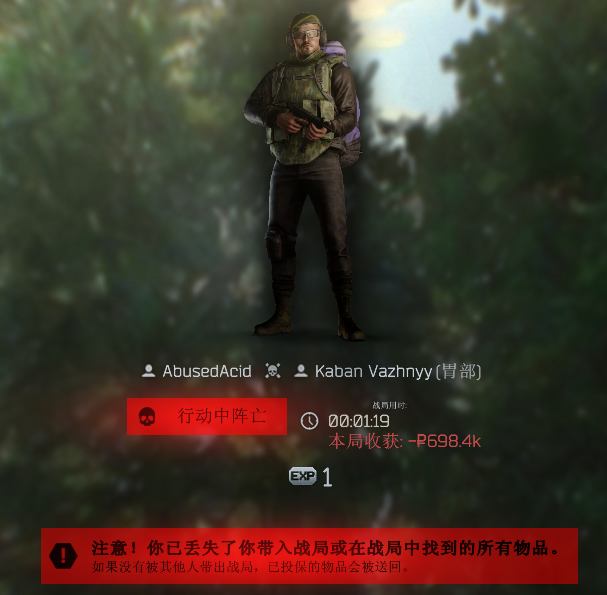
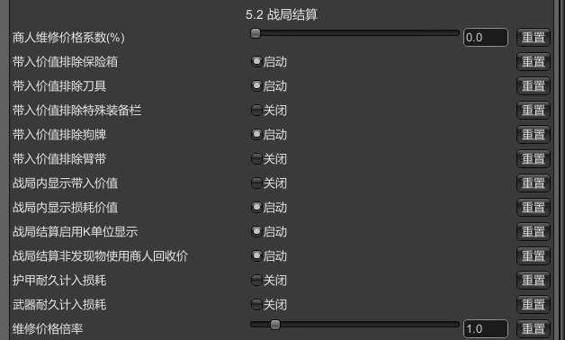
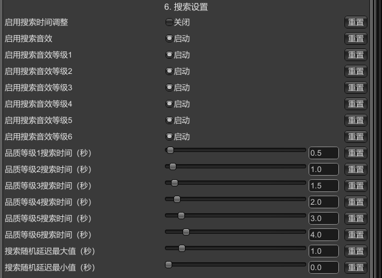

# QuickPrice

**Real-time item value display for SPT (Single Player Tarkov) 4.0.0**


[English](README.md) | [中文文档](README_CN.md)

---

## 📖 Overview

**QuickPrice** is a comprehensive SPT mod that displays real-time item prices directly in your inventory tooltips. Make informed decisions about what to loot, sell, or keep with color-coded price indicators and detailed market information.

### ✨ Key Features

- 💰 **Real-time Price Display** - Shows flea and trader prices with banned-item source control
- 🎨 **Color-Coded Items** - Six-tier value colors with optional inventory background coloring
- 🔫 **Weapon Mod Pricing** - Calculates total value including all attachments and details
- 🛡️ **Armor & Ammo Indicators** - Armor class and ammo penetration coloring with extra stats
- 📊 **Value Density** - Price-per-slot and stack unit-price thresholds to avoid inflated totals
- 🧭 **Ground Loot Labels** - In-raid item names show price and value coloring
- 📈 **Raid Summary Overlay** - Brought/loss/loot/settlement tracking with K-unit formatting
- 🔊 **Search Sound & Time** - Custom search audio and six-tier duration presets (per-tier toggles)
- ⚡ **Dynamic Price Cache** - Auto refresh on stash open plus manual refresh hotkey (F10)
- 🧩 **Server Module Enhancements** - Hot-reloadable config, ragfair blacklist, trader buyback cache

---

## 📸 Screenshots

### Price Display & Tooltip

*Real-time price information displayed in item tooltips with color-coded value indicators*

### Color-Coded Inventory

*Large inventory view showing the six-tier color coding system across multiple items*

### Inventory Overview

*Mixed item types including weapons, ammo, and containers with price information*

### Weapon Mod Price Breakdown

*Detailed attachment tree with flea/trader pricing and total breakdown*

### Raid Summary Overlay

*In-raid brought/loss/loot/settlement overlay at the bottom of the HUD*

### Raid Settlement Result

*Post-raid summary view with settlement value shown*

### Raid Summary Settings

*Raid summary options in the F12 configuration manager*

### Search Sound & Time Settings

*Per-tier search sound and duration presets in configuration*

---

## 🚀 Installation

### Prerequisites

- SPT (Single Player Tarkov) **4.0.0**
- BepInEx **5.4.22** or higher (included with SPT)

### Client Installation (BepInEx Plugin)

1. Download the latest release from [Releases](https://github.com/2324834989/quickprice-spt/releases)
2. Extract `QuickPrice.dll` to:
   ```
   SPT_Install_Directory/BepInEx/plugins/QuickPrice/
   ```
3. Launch SPT and enjoy!

### Server Installation (Optional - For Dynamic Prices)

1. Extract the server module to:
   ```
   SPT_Install_Directory/user/mods/QuickPrice/
   ```
2. Restart the SPT server
3. Enable "Use Dynamic Prices" in the client configuration (F12)

---

## 🎮 Usage

### Basic Controls

- **Hover to View Prices** - Prices show on hover by default
- **Optional Ctrl Requirement** - Enable in config to require `Left Ctrl` or `Right Ctrl`
- **Manual Refresh** - Press `F10` to refresh dynamic prices (configurable)

### Color Coding System

#### Price-Based Colors (Default Items)
| Color | Price Range | Indicator |
|-------|-------------|-----------|
| ⚪ White | ≤ 25,000₽ | Common items |
| 🟢 Green | 25,001 - 45,000₽ | Low value |
| 🔵 Blue | 45,001 - 70,000₽ | Medium value |
| 🟣 Purple | 70,001 - 100,000₽ | High value |
| 🟠 Orange | 100,001 - 250,000₽ | Very high value |
| 🔴 Red | > 250,000₽ | Extremely valuable |

#### Penetration-Based Colors (Ammo & Magazines)
| Color | Penetration | Effectiveness |
|-------|-------------|---------------|
| ⚪ White | < 20 | Low penetration |
| 🟢 Green | 20 - 29 | Light armor |
| 🔵 Blue | 30 - 39 | Medium armor |
| 🟣 Purple | 40 - 49 | Heavy armor |
| 🟠 Orange | 50 - 59 | Class 5 armor |
| 🔴 Red | ≥ 60 | Class 6 armor |

#### Armor Class Colors
| Color | Armor Class | Protection Level |
|-------|-------------|------------------|
| ⚫ Gray | Class 1 | Minimal |
| 🟢 Green | Class 2 | Light |
| 🔵 Blue | Class 3 | Medium |
| 🟣 Purple | Class 4 | Heavy |
| 🟠 Orange | Class 5 | Very Heavy |
| 🔴 Red | Class 6 | Maximum |

### Configuration

Press **F12** in-game to open BepInEx Configuration Manager and customize:

- Toggle price display behavior (hover vs. Ctrl)
- Select price sources, banned-item behavior, and K-unit formatting
- Configure search sound/time presets and per-tier toggles
- Tune raid summary options (brought/loss, non-FIR pricing)
- Manage cache mode, auto refresh, and the manual refresh key
- Performance tuning for large containers

---

## ⚙️ Configuration Options

### Price Display
- **Enable Plugin** - Master toggle
- **Show Flea/Trader Prices** - Toggle each price source
- **Hide Flea Price for Non-FIR** - Optional suppression for non-FIR items
- **Banned Item Price Source** - Default / Flea / Trader
- **Show Flea Tax** - Listing fee and net profit display
- **Show Best Price in Bold** - Emphasize the highest price line
- **Show Price Per Slot** - Value density calculation
- **Weapon Mod Pricing** - Include attachments and optional detailed breakdown
- **Use K-Unit Display** - Format prices ≥ 10,000 as ₽10k
- **Stack Unit-Price Threshold** - Show unit price for large stacks

### Interaction & Tooltip
- **Require Ctrl Key** - Optional hover gating
- **Tooltip Delay** - 0–2 seconds
- **Disable Tooltip Width Limit** - Prevent forced line wrapping
- **Show Tooltip Separator** - Underline below the item name

### Colors & Ground Loot
- **Enable Color Coding** - Price/penetration-based colors
- **Use Caliber Penetration Power** - Ammo uses penetration thresholds
- **Color Item Name** - Apply colors to tooltip item names
- **Enable Background Coloring** - Color inventory slots (experimental)
- **Show Ground Item Price** - In-raid ground label price (requires name coloring)
- **Armor Class Coloring** - Color armor by class and show class text
- **Reset Thresholds Button** - Reset price/penetration thresholds in the F12 manager

### Cache & Refresh
- **Use Dynamic Prices** - Fetch flea prices from the server module
- **Price Cache Mode** - Permanent / 5min / 10min / Manual
- **Auto Refresh on Open Inventory** - Background refresh when cache expires
- **Manual Refresh Key** - Default `F10`

### Raid Summary
- **Brought/Loss in Raid** - Show brought/loss values in-raid
- **Exclude Items** - Secure container, knife, armband, dogtag, special slots
- **Use Trader Price for Non-FIR** - Raid summary calculations
- **Use K-Unit in Raid Summary** - Compact formatting
- **Durability Loss** - Include weapon/armor durability and repair multipliers

### Search Settings
- **Enable Search Sound** - Custom audio by value tier (levels 1–6)
- **Per-Tier Sound Toggles** - Disable specific levels if needed
- **Enable Search Time Adjustment** - Override search time by tier
- **Random Delay** - Min/Max random offset
- **Per-Tier Durations** - Level 1–6 time presets

### Debug
- **Client Log Gating** - Control Debug/Warn output

---

## 🛠️ Building from Source

### Client (BepInEx Plugin)

```bash
cd Sources/Client
dotnet build -c Release
```

Output: `bin/Release/net471/QuickPrice.dll`

### Server (SPT Module)

```bash
cd Sources/Server
dotnet build -c Release
```

Output: `bin/Release/quickprice.dll`

### Requirements
- .NET Framework 4.7.1 SDK (client)
- .NET 9.0 SDK (server)
- SPT 4.0.0 assemblies (see .csproj for paths)

---

## 📊 Performance Optimization

QuickPrice includes intelligent performance optimizations:

- **Smart Container Calculation** - Limits recursion depth and item count (can be disabled)
- **Async Price Loading** - Non-blocking background updates
- **Efficient Caching** - Configurable cache expiration
- **Large Container Skipping** - Avoids lag on item boxes above the configured threshold

Default limits (recommended):
- Max recursion depth: **10 layers**
- Max items per container: **100 items**
- Large container threshold: **50 items**

---

## 🤝 Contributing

Contributions are welcome! Please feel free to submit issues and pull requests.

### Development Guidelines
- Follow existing code style
- Test thoroughly with SPT 4.0.0
- Update documentation for new features
- Maintain Chinese localization

---

## 📝 Changelog

### Version 2.0.0 (2026-01-13)
- Added client log gating and server-config sync controls
- Added search sound system and six-tier search time presets
- Added raid summary tracking/overlay and non-FIR pricing options
- Added trader buyback cache, ragfair blacklist support, and aggregated refresh logging
- Improved tooltip/ground label display (K-unit formatting, separators, banned item price source)

### Version 1.0.0 (2025-10-21)
- Initial release
- Complete rewrite with new project structure
- Full SPT 4.0.0 compatibility
- Performance optimizations for large containers
- Six-tier color-coding system
- Armor class detection and coloring
- Trader price comparison
- Configurable cache modes
- Chinese localized configuration

---

## 📄 License

This project is licensed under the MIT License - see the [LICENSE](LICENSE) file for details.

---

## 🙏 Acknowledgments

- SPT-AKI Development Team for the amazing SPT platform
- BepInEx team for the modding framework
- All contributors and testers

---

## 📞 Support

- **Issues**: [GitHub Issues](https://github.com/2324834989/quickprice-spt/issues)
- **Discussions**: [GitHub Discussions](https://github.com/2324834989/quickprice-spt/discussions)

---

**Made with ❤️ for the SPT community**
